# Readme and manual
## For automatic tileset extractor and DFS wave collapse
This Readme provides a brief introduction and some instructions on how to use the automatic tileset extractor and DFS wave collapse. This program allows the user to create new worlds using a wave collapse function. Contrary to other solutions, this program also allows the user to extract their own tiles from existing worlds and tilesets (from, for example, retro games) to use during generation. This program has a workflow consisting of three parts:
1. Extracting tiles as separate images from a single tileset image.
2. Detecting the rules of the tileset from an original world: what tiles can be adjacent to what tiles. An original, sensible world is required for this step, for example, the overworld of the retro game.
3. Generating a new world of a given size using the tiles from 1. and rules from 2. Note that since game worlds are very large and complex, the generation may lead to blocking situations. We therefore implemented a DFS variant of wave collapse to ensure a viable world is created. Note that for complex worlds with hundreds of tiles and rules, generation might take a very long time. A better solution may be implemented later on.

Tested using [Overworld Tileset](https://www.spriters-resource.com/game_boy_gbc/thelegendofzeldalinksawakeningdx/sheet/9445/) and [Koholint Island (GBC)](https://www.spriters-resource.com/game_boy_gbc/thelegendofzeldalinksawakeningdx/sheet/9444/) from [Spriters Resource: Link's Awakening DX](https://www.spriters-resource.com/game_boy_gbc/thelegendofzeldalinksawakeningdx/)

## Installation
The required packages can be installed using poetry. To install the required packages, use:
> poetry install
in the directory containing the `pyproject.toml` file.

## Usage (GUI)
1. If your tileset happens to have a similar layout to the tileset we used (grid color same as top left pixel in tileset image), the only user input needed is an input image and an output folder. If not it may be needed to manually set tile size, grid offsets and grid width. Extracted tiles can be in the specified folder.

2. specify the filder with individual tiles from step 1 and supply the a png of the game world (if your world does not contain seperate sections it may be needed to add a small uniquely colored border around the entire world). The world sections folder is a temporary folder, you can name this however you want. The file from Output neighbour filename will be a json containing the 'rules' of the tiles found in the world. Due to (afawk) PyQt limitations you cannot create this file from the selection window so we suggest either: a. creating an empty file, rename it to something like 'rules.json' and select that file or b. manually input the path and filename into the text field.

It will now attempt to match tiles from the world with tiles in the tileset folder. If a tile cannot be found it will ask the user for input trough the terminal window. A tile will be shown next to the section of the world where it was found. The user can now decide to either:
a. Add this tile as a new tile to the tileset folder (if the original tileset was incomplete) by typing 'n' or 'new' 
b. Link the shown tile to an existing tile by typing the number assigned to the tile in the tile folder (in case of e.g. replacing placeholder tiles for animated tiles with one of the still frames)
c. Ignore this and all further occurences of this tile (it will not be used for rule generation)
d. Ignore all unknown tiles in this section 

When this process is completed the neigbour file can be used in step 3 to continuously generate new worlds.

3. Set how many tiles wide and high you want the world to be (we recommend a maximum of about 10x10 for complex worlds). Select the tile folder generated in step 1 and the neighbour rules generated in step 2. Tell the program how your world file should be called (similar issue as the json in step 2) and finally decide if you want to see live world generation (might not work properly on all linux installations). Press 'Generate World' to generate a new world. If you want to rapidly generate many worlds (either because the generation gets stuck or just because you want a lot of them) it might be tedious to refill all the fields, you may want to run the script directly from terminal instead. Don't forget to change the output world file name or your previous world will be overwritten. 

## Examples
Here are some examples generated using this project using the Link's Awakening DX tileset.

## Known issues and TODOs
This program is still very much in beta and is a pet project. Development may halt at any time. Even still, this comprehensive list describes some or most features that may be nice to implement. Feel free to create a pull request if you feel like implementing something.

### Tile extractor
- Smarter detection of grid displayed between tiles. Currently, the grid is detected by taking the color of the pixel at [0,0] which works most of the time, but not all tilesets are formatted in the same way. Maybe some grid detection algorithm would work.

### Rules detector
- Weighted rules. Currently, the rules detector only checks whether a tile can be next to another tile, not how often this occurs. This currently leads to worlds with strange formations or rare features that occur very often.
- Support for worlds that are at the same time also the tileset. Some worlds also have a grid to show the borders between tiles. These will not work in this current implementation, as the rules detector expects there to not be any spacing between tiles.
- Tiles that are found in the world but not in the tileset now show in terminal using `climage`. This works, but it would be prettier if there was an option to have a PyQt popup with a UI. An input box that represents what tile it should be, a skip-button, a skip section button, a skip all button. Currently, this seems very time-consuming and tedious to implement.
- Showing what tile the user is asked to give information about in the world section, for example with a red outline. This makes it easier for the user to determine what tile the algorithm means.
- A larger margin for error when detecting what tiles are not found. In some tilesets, particle effects are present in the world image. Since these are not an exact match to a tile in the tileset, the user will be prompted to fill what tile it should be. A higher tolerance would prevent quite some work.
- Potentially looking for neighbor tile rules between world sections. Currently, the rule detector does not check between world sections what tiles could be adjacent to each other. Some games have a complete change of area style / biome between world sections, so this is harder than it sounds.

### Wave collapse
- Guaranteed fast and non-blocking generation. The current DFS implementation is the best we could come up with and works properly on small generated worlds or simple tilesets. However, for large, complex tilesets or worlds, this will result in very slow generation with a lot of repeated, similar mistakes.
- Seeding generation, allowing the user to put some tiles in the world so, for example, a path between two locations is guaranteed. This gives more control to the user and will result in less random worlds.
- Potentially a nicer UI showing the entropy of non-determined tiles changing over time.
- Non-infuriating progress-bar.

### UI
- Generally better, nicer UI with buttons replaced. Sorry, we're no UI wizards. This was our first project ever involving UI.

## Some examples of generated worlds
Here are a few examples of worlds generated using this project. These worlds are 8x10, the original size used in Link's Awakening on the GameBoy.

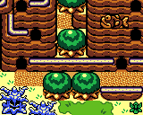
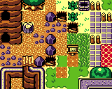
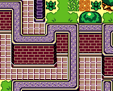
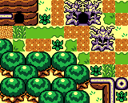
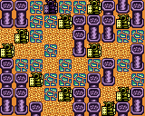
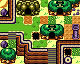
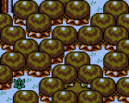
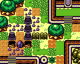

The following worlds have a larger size and took a longer time to complete. Some of these worlds also use tiles not present in the tileset and were manually added with our project.

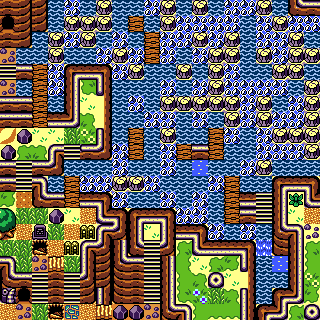
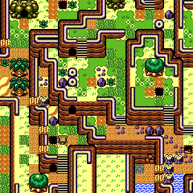

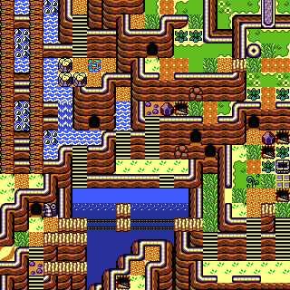
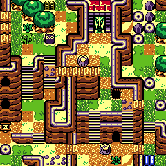